CUDA Rasterizer
===============

[CLICK ME FOR INSTRUCTION OF THIS PROJECT](./INSTRUCTION.md)

**University of Pennsylvania, CIS 565: GPU Programming and Architecture, Project 4**

* Name: Jiahao Liu
* Tested on: Windows 10, i7-3920XM CPU @ 2.90GHz 3.10 GHz 16GB, GTX 980m SLI 8192MB (personal computer)

Project Description
======================

This project is a implementation of a simple rasterizer using cuda. Mainly implements part of the OpenGL pipeline, the vertex shader to fragment shader.

Features implemented
======================

* Basic Lambert and Blinn shading.
* Perspective correct interpolation.
* Correct color interpolation between points on a primitive.
* UV texture mapping with bilinear texture filtering and perspective correct texture coordinates.
* Back face culling optimization.
* Line rasterization mode.
* Point cloud rasterization mode.

Rasterization result
======================

* Perspective correct interpolation

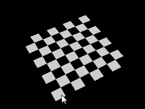

* Correct color interpolation between points on a primitive.

This use normal as color for each point.

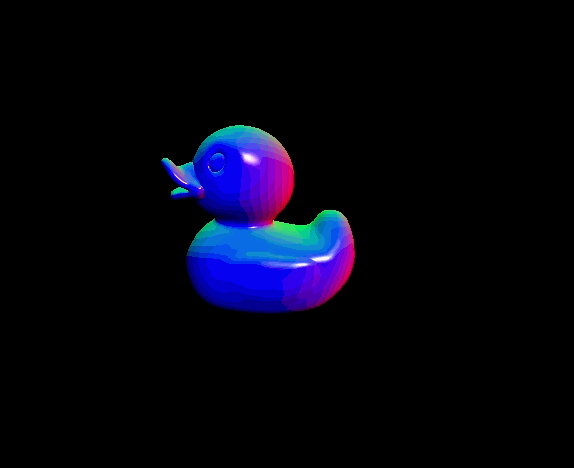

* Basic Lambert and Blinn shading.

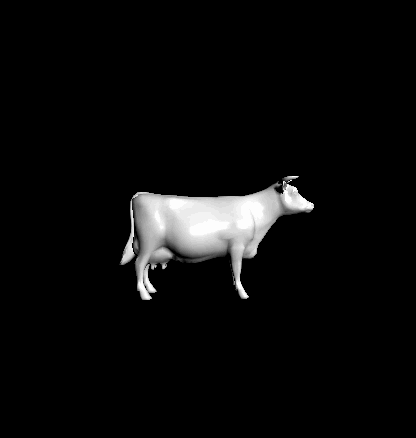

* UV texture mapping with bilinear texture filtering and perspective correct texture coordinates.

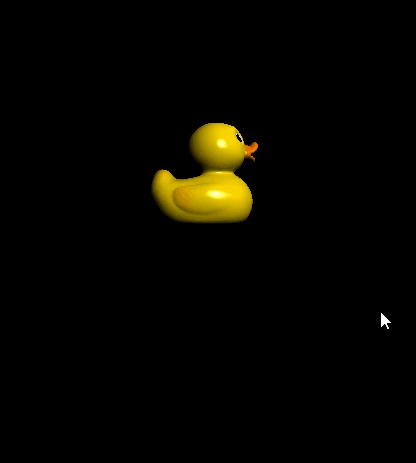

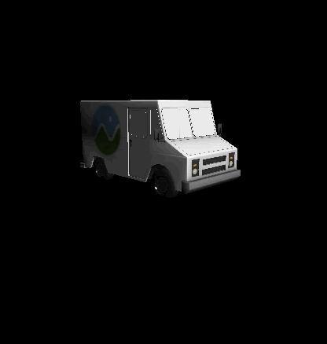

* Line rasterization mode.

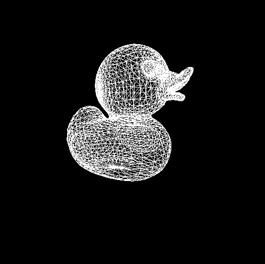

* Point cloud rasterization mode.

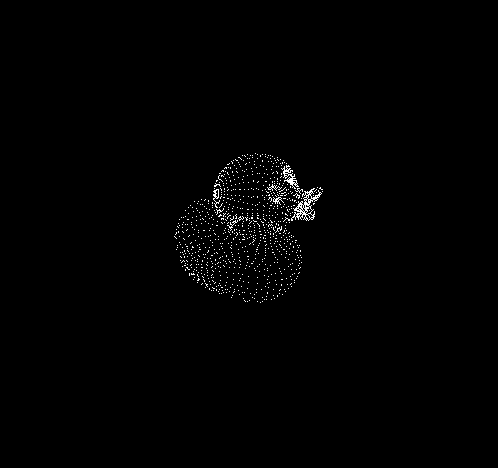

Performance Analysis
======================

* Render time for different stage

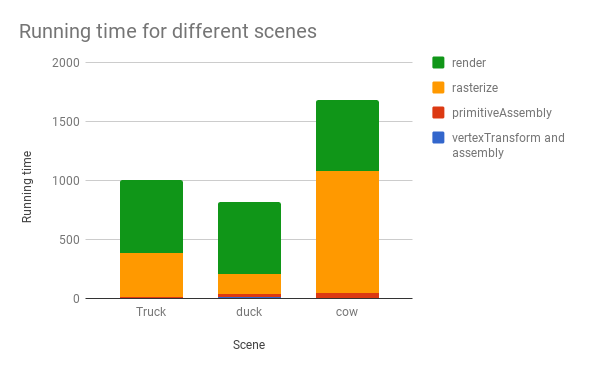

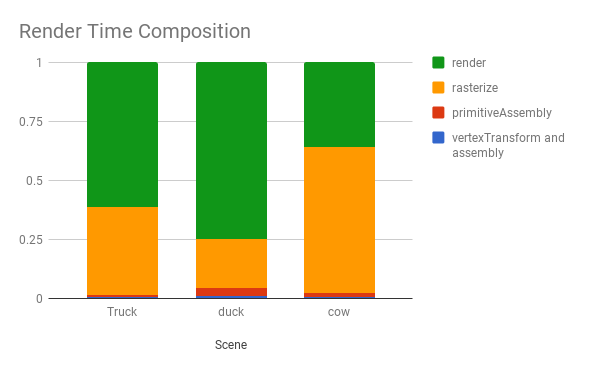

Basically running time for different stages is positive correlated. The more vertex, faces a primitive has, the more time needed on different stages.

Also the more faces are, more time needed for render.

* Back face culling optimization

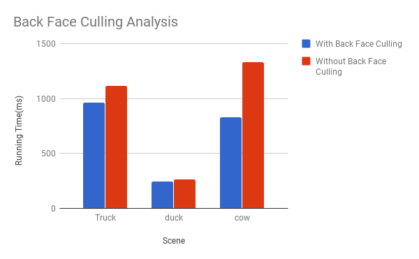

Back face culling will drop those faces has the same direction as camera did. This will decrease the running time for the whole rasterization.

* Running time for different rasterization mode

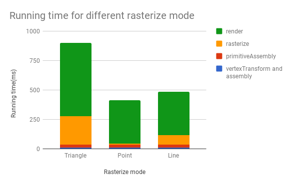

It is clear that for all rasterization mode the take the same amount of time on vertex transform and primitive assembly. But triangle rasterization mode takes more time than line mode and point mode does. Point mode has the least running time during rasterization stage.

### Credits

* [tinygltfloader](https://github.com/syoyo/tinygltfloader) by [@soyoyo](https://github.com/syoyo)
* [glTF Sample Models](https://github.com/KhronosGroup/glTF/blob/master/sampleModels/README.md)
